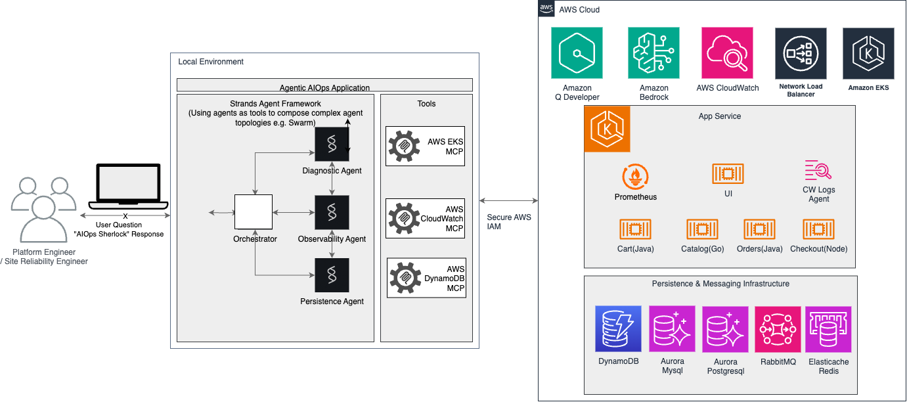

# 🔍 Agentic AIOps Kubernetes Sherlock

**Agentic AIOps Kubernetes Sherlock** (or in short **"AIOps Sherlock"**) is a Diagnostics Assistant for Kubernetes workloads on Amazon EKS to dive deeper into how agentic AI, powered by Strands Agents SDK, MCP Servers and Amazon Bedrock are delivering practical AIOps capabilities. 

It demonstrates how AI can augment human expertise (Plaftorm Engineers and/or SREs - Site Reliability Engineers) by providing:

- **Intelligent Automation**: Reducing toil while preserving human oversight
- **Collaborative Intelligence**: Multiple AI specialists working together
- **Accessible Expertise**: Making expert-level analysis available to all team members

**AIOps Sherlock**  is developed to demonstrate the practical application of agentic AI in AIOps.

You can use it to experiment with multi-agent AI architectures in operational scenarios. It showcases how specialized AI agents can collaborate to diagnose operational issues for a complex Kubernetes workload; problems that would typically require coordination between multiple engineering teams with different domain expertise.


## 🎯 Overview

**Agentic AIOps** systems elevate troubleshooting capabilities by deploying multiple, specialized AI agents that collaboratively 'reason' across vast and disparate data sources.


**Agentic AIOps Kubernetes Sherlock**  has a flexible agentic architecture that demonstrates AIOps capabilities where AI agents work alongside platform engineers to create more reliable, efficient, and intelligent operations. You can use it to explore best practices such as: 

* **Specialization**: Each agent focuses on a specific domain for maximum expertise
* **Collaboration**: Agents share context and build on each other's findings
* **Extensibility**: New agents can be added without affecting existing functionality
* **Observability**: Tracing and monitoring of agent interactions


## 🏗️ Architecture



## Solution Components
- **Strands Agents SDK**: For multi-agent orchestration. **Strands Agents SDK** enables seamless orchestration between multiple AI agents with production-ready patterns, built-in observability, and standardized interfaces - giving platform engineers and SREs the foundation to build scalable multi-agent AIOps systems that coordinate specialized expertise across operational domains.
- **Model Context Protocol (MCP)**: For EKS, CloudWatch and DynamoDB integration. **MCP** standardizes how AI applications access external 
tools and data sources, eliminating custom integrations and enabling rapid system extension through community-built servers that provide reliable, consistent interfaces to services like Kubernetes, 
AWS, and monitoring tools.
- **Amazon Bedrock**: For Large Language Model capabilities. **Amazon Bedrock** provides the foundational large language model capabilities that power our agentic system, offering enterprise-grade AI models through a fully managed service with built-in security, compliance, and cost controls - enabling platform engineers to focus on building intelligent operational workflows rather than managing AI infrastructure, while ensuring their agentic systems have access to state-of-the-art reasoning capabilities for complex troubleshooting and analysis.


## Understanding the Sherlock Agents

The system uses a multi-agent architecture where specialized agents collaborate to provide comprehensive analysis. The system has an **🎯 Orchestrator** component which coordinates agent interactions and synthesizes results:

| Agent Name | Functionality | AWS MCP Tool Used |
|------------|---------------|-------------------|
| **Diagnostic Agent** | - Analyze pod health and resource utilization<br>- Identify configuration issues and misconfigurations<br>- Examine cluster events and error patterns<br>- Provide actionable recommendations for infrastructure problems | EKS MCP Server |
| **Observability Agent** | - Query CloudWatch metrics for performance analysis<br>- Search application logs for error patterns<br>- Analyze historical trends and anomalies<br>- Correlate metrics across multiple services<br>- Identify performance bottlenecks and operational issues | AWS CloudWatch MCP Server |
| **Persistence Agent** | - Analyze DynamoDB table performance and capacity utilization<br>- Detect throttling events and capacity issues<br>- Investigate query patterns and optimization opportunities<br>- Monitor read/write capacity consumption<br>- Provide recommendations for scaling and performance tuning | AWS DynamoDB MCP Server |yes

##  Understanding the Agent Prompts

Each agent's behavior is defined by its system prompt. This prompt gives the agent its personality, expertise, and instructions for collaboration. We specify:

* Tool usage strategy
* Search & filtering strategy
* Overview of other agents
* Handoff decision criteria
* Reporting criteria
* Example diagnostic response template
* Important guidelines

A workload overview info is provided statically in the prompt to the Diagnostics Agent.

### Understanding the Swarm Architecture 
 These agents work together using the **Swarm pattern**. The Swarm pattern enables collaborative intelligence where agents:

- **Share Context**: All agents have access to the conversation history and findings
- **Make Handoff Decisions**: Agents can transfer control to more suitable specialists
- **Build on Each Other's Work**: Later agents can leverage earlier findings
- **Provide Comprehensive Analysis**: Multiple perspectives lead to better solutions

### Working with an Evaluation Framework
For developing Agentic AIOps solutions for real-world scenarios, we need a robust evaluation framework that enables data-driven, quantitative comparison of experiments.

We need observability to measure system behavior and performance. 
**AIOps Sherlock** also demonstrates a systematic evaluation mechanism, allowing you to measure and improve your agentic system's performance with concrete metrics and reproducible scores.

Strands Agents provides a combination of instrumentation, data collection techniques for developers to effectively build, debug and maintain agents. Strands natively integrate with OpenTelemetry, an industry standard for distributed tracing. Traces can be visualized and analyzed using any OpenTelemetry-compatible tools (LangFuse, Jaeger etc.). [Langfuse](https://github.com/langfuse/langfuse)  is an open-source observability and analytics platform designed specifically for LLM applications. Langfuse helps you track, monitor, and analyze your LLM application's performance, costs, and behavior. AIOps Sherlock provides examples of how to use the Strands Agent traces to monitor LLM performance, track token consumption, analyze costs, and evaluate the quality of your agentic AIOps system's responses. 

# A Real-World Use Case

We tested **agentic AIOps Sherlock** concepts with **AWS Retail Store Sample App** - a distributed e-commerce platform with multiple microservices running on Amazon EKS. You can use the Retail Store app or another workload of your choice to see Agentic AIOps Sherlock in Action.


[The AWS Containers Retail Store](https://github.com/aws-containers/retail-store-sample-app) is a distributed e-commerce application designed to illustrate various concepts related to containers on AWS. It provides a realistic microservices architecture with multiple components, different programming languages, and various AWS service dependencies. This application is perfect for our Agentic AIOps Sherlock in action because:

- **Realistic Complexity**: Multiple microservices with real interdependencies
- **Multi-Layer Problems**: Issues can span infrastructure, application, and data layers
- **Observable**: Rich metrics and logging for analysis
- **Multi-Language**: Components written in Java, Go, and Node.js
- **AWS Native**: Uses DynamoDB, RDS, ElastiCache, and other AWS services
- **Scalable Complexity**: Can simulate various load and failure scenarios


## 🚀 Quick Installation

For a complete setup including all dependencies and the retail store sample application, see our comprehensive installation guide:

**📖 [Complete Installation Guide](INSTALLATION.md)**

The installation guide covers:
- System dependencies (Terraform, kubectl, UV)
- AWS MCP server setup
- Retail store sample application deployment
- Sherlock configuration and testing

## ⚡ Quick Start (If Already Installed)

If you already have the system installed, you can quickly test it:

```bash
# Navigate to Sherlock directory
cd ~/sample-agentic-aiops-k8s-sherlock

# Install dependencies
uv sync

# Activate virtual environment
source .venv/bin/activate

# Configure Langfuse telemetry
export LANGFUSE_SECRET_KEY=your_langfuse_secret_key
export LANGFUSE_PUBLIC_KEY=your_langfuse_public_key
export LANGFUSE_HOST="https://us.cloud.langfuse.com"

# Configure kubectl access to retail store cluster
aws eks --region us-east-1 update-kubeconfig --name retail-store

# Intentionally restrict carts deployment resources to create incidents for AI agent demonstration
kubectl patch deployment carts -n carts --patch '{
  "spec": {
    "template": {
      "spec": {
        "containers": [{
          "name": "carts",
          "resources": {
            "limits": {
              "cpu": "500m",
              "memory": "512Mi"
            },
            "requests": {
              "cpu": "500m", 
              "memory": "512Mi"
            }
          }
        }]
      }
    }
  }
}'

# Intentionally throttle DynamoDB table to create database incidents for AI agent demonstration
aws dynamodb update-table \
    --table-name retail-store-carts \
    --billing-mode PROVISIONED \
    --provisioned-throughput ReadCapacityUnits=1,WriteCapacityUnits=1 \
    --global-secondary-index-updates '[
        {
            "Update": {
                "IndexName": "idx_global_customerId",
                "ProvisionedThroughput": {
                    "ReadCapacityUnits": 1,
                    "WriteCapacityUnits": 1
                }
            }
        }
    ]'

# Test the orchestrator (AI agents will detect and analyze K8s, DynamoDB constraints and traffic patterns). Default model id is: "us.anthropic.claude-sonnet-4-20250514-v1:0" 
python ./scripts/test_orchestrator.py --query "Could you analyze why the carts service is having issues?"


# Test with a specific Bedrock model
python scripts/test_orchestrator.py --model-id "us.anthropic.claude-sonnet-4-20250514-v1:0"

# Test with custom query and model
python scripts/test_orchestrator.py --query "Analyze the carts service performance issues" --model-id "amazon.nova-pro-v1:0"

# View available options
python scripts/test_orchestrator.py --help

```

### Available Models
You can reference the [AWS Bedrock Supported Models documentation](https://docs.aws.amazon.com/bedrock/latest/userguide/models-supported.html) to find appropriate models for your specific requirements.

**Default Models:**
- Test Orchestrator: `us.anthropic.claude-sonnet-4-20250514-v1:0`

## 🚦 Generate Traffic Load

To create realistic load and trigger the resource constraints, run the traffic generator in a separate terminal:

```bash
# Open a new terminal and navigate to Sherlock directory
cd ~/sample-agentic-aiops-k8s-sherlock

# Activate virtual environment
source .venv/bin/activate

# Configure kubectl access
aws eks --region us-east-1 update-kubeconfig --name retail-store

# Generate continuous traffic to carts service
python scripts/generate_traffic.py
```

This will create load on the constrained carts service, making the resource and database throttling issues more observable by the AI agents.


## Security

See [CONTRIBUTING](CONTRIBUTING.md#security-issue-notifications) for more information.

## License

This library is licensed under the MIT-0 License. See the LICENSE file.
